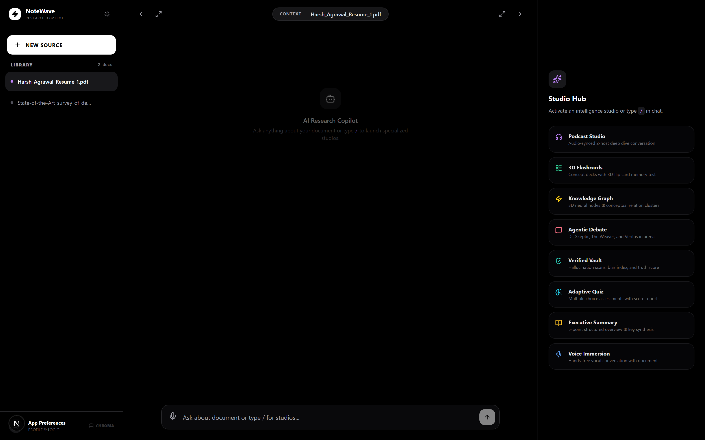

<div align="center">

# NoteWave

## **AI Research Copilot & Knowledge Hub**

Your AI Research Copilot. Turn any PDF into interactive research chats, audio deep-dives, 3D concept maps, agentic debates, adaptive quizzes, and integrity audits - all inside a pitch-black, distraction-free workspace.



</div>

## Important Notice

> **It is strongly recommended to run this application locally.**
> The public deployment is intended purely as a portfolio demo. Because the LLM layer depends on Gemini free-tier keys, it may be **rate-limited** or run out of quota without notice. NoteWave handles this gracefully - it rotates through a pool of keys and automatically falls back to a **local Ollama model**, so it keeps answering even when the cloud quota is exhausted. Running locally gives you full control and complete data privacy.

---

## The Intelligence Studios

NoteWave organizes research into specialized "Studios," each designed for a specific cognitive task:

- **Conversational RAG Copilot**
  Multi-turn document chat with semantic retrieval over ChromaDB, high-integrity system prompts, and a live status line. Greetings are handled conversationally - no accidental document dumps.

- **Podcast Studio**
  Generates an engaging audio deep-dive conversation between AI hosts ("Alex" & "Dr. Taylor") with Web Speech playback and a per-line script tracker.

- **Flashcard Studio**
  AI-driven concept extraction with an interactive 3D flip UI for active-recall studying.

- **3D Knowledge Graph**
  An interactive 3D Force-Directed Graph (`react-force-graph-3d`) visualizing relationships between core concepts, with a 2D SVG fallback so it always renders.

- **Agentic Debate**
  Multi-persona research arena where *Dr. Skeptic* (Critic), *The Weaver* (Synthesizer), and *Veritas* (Fact-Checker) debate the core thesis of your documents.

- **Verified Vault**
  Integrity auditor that computes a Truth Score, Bias Index, provenance signature, and flags unsupported claims.

- **Quiz Studio**
  Generates custom multiple-choice assessments with real-time grading, conceptual difficulty tagging, and mastery tracking.

- **Voice Immersion**
  Hands-free mic-based querying (Web Speech API) for talking to your document.

- **Executive Summary**
  Structured 5-point executive synthesis and takeaway extraction.

---

## Immersive Features

- **Focus Mode**
  UI transformation that dims distractions and simplifies the workspace for deep work.

- **Command Orchestration**
  Global `/` command palette with full keyboard navigation (`Up` / `Down` / `Enter`) for instant studio launching.

- **Local Persistence**
  API key, document metadata, and session settings synced to `localStorage` for privacy-first continuity.

- **Key Rotation & Local Fallback**
  A round-robin Gemini key pool that beds rate limits, plus automatic failover to a local Ollama model in `auto` mode.

---

## System Architecture

1. **Ingestion Pipeline**
   PDF text is semantically chunked, embedded with Gemini embeddings (768-dim), and stored in ChromaDB with strict `source_filename` filtering.

2. **Hardened Chat Logic**
   High-integrity system prompts prevent hallucinations and enforce academic rigor; a retrieval gate skips vector search for greetings and trivial messages.

3. **Live Progress via Job Queue**
   Chat runs as a background job; the UI polls a status endpoint every ~1.2 s and streams the backend's progress messages.

4. **Studio Generation**
   Every studio is a rigorously constrained JSON prompt with graceful fallbacks, so no studio can crash the API on malformed model output.

---

## Challenges & Learnings

- **The Quota War**
  Chat hung for minutes because all Gemini free-tier keys were exhausted. Solved with key rotation on `429`/`RESOURCE_EXHAUSTED` (fast rotation when a daily quota is blown, exponential backoff otherwise) and a transparent **Ollama fallback**.

- **Local Model Constraints**
  With only 7.7 GB RAM available, `qwen3:8b` OOM'd and `qwen3:4b` thrashed. The sweet spot became `qwen3:1.7b`, and sending `"think": false` stopped the model from streaming its inner monologue before the real answer.

- **Greeting Grace**
  Asking "hello" used to dump the entire stored document back at you. `_should_retrieve()` now detects greetings and chit-chat, disabling retrieval so the assistant replies conversationally.

- **Always-Render Graphics**
  WebGL can fail silently and blank the canvas. GraphStudio solves this with SSR-free dynamic imports plus a 2D SVG `ConceptMap2D` fallback so the concept map always renders.

---

## Tech Stack

- **Core:** [Next.js 16](https://nextjs.org/), React 19, TypeScript, Tailwind CSS, Radix UI Primitives, framer-motion
- **Backend:** FastAPI, LangChain, ChromaDB, Google GenAI SDK, httpx
- **LLM:** Google Gemini (Gemini-first) with **automatic local Ollama fallback**
- **Embeddings:** Google Gemini Embedding (`models/gemini-embedding-001`, 768-dim)
- **Vector Store:** ChromaDB (local, persistent)
- **Spatial UI:** `react-force-graph-3d` & Three.js
- **Voice:** Web Speech API with optional ElevenLabs TTS

---

## How to Run Locally

### Backend (FastAPI)

```bash
cd backend
python -m venv venv
# Windows:
venv\Scripts\activate
# macOS / Linux:
source venv/bin/activate

pip install -r requirements.txt
uvicorn main:app --reload --port 8000
```

API starts on `http://localhost:8000` (interactive docs: `http://localhost:8000/docs`).

### Frontend (Next.js)

```bash
cd frontend
npm install --legacy-peer-deps
npm run dev
```

App runs on `http://localhost:3000`.

### Environment Variables (`backend/.env`)

```env
GOOGLE_API_KEYS=key1,key2,key3      # Comma-separated pool (rotated on rate limits)
GOOGLE_API_KEY=your_key             # Single-key fallback
LLM_PROVIDER=auto                   # auto | gemini | ollama
OLLAMA_MODEL=qwen3:1.7b             # Local model used when Gemini is unavailable
ELEVENLABS_API_KEY=your_key         # Optional - browser TTS is used when absent
```

### Docker Compose

```bash
docker compose up --build
```

- Frontend: `http://localhost:3000`
- Backend API: `http://localhost:8000`

---

## Self-Hosting with Ollama

NoteWave natively supports fully-private execution over a local Ollama instance - no cloud LLM required.

1. Download [Ollama](https://ollama.com/) and pull a model:
   ```bash
   ollama pull qwen3:1.7b
   ```
2. In `backend/.env`, set `LLM_PROVIDER=ollama` (or keep `auto` for Gemini-first with local fallback) and `OLLAMA_MODEL=qwen3:1.7b`.
3. Restart the backend. All prompts now route securely to your local `http://localhost:11434` engine.

---

## Project Structure

```
ai-knowledge-hub/
├── backend/
│   ├── main.py           # FastAPI app - chat (job queue + polling), upload, studios, TTS
│   ├── rag.py            # RAG engine - embeddings, ChromaDB, Gemini + Ollama fallback, studios
│   ├── key_pool.py       # Round-robin Gemini key pool with rate-limit detection
│   ├── tts.py            # ElevenLabs synthesis (optional)
│   ├── requirements.txt
│   ├── chroma_db/        # Persistent vector store (auto-created)
│   └── documents/        # Uploaded PDFs
├── frontend/
│   ├── src/
│   │   ├── app/
│   │   │   ├── globals.css          # Pitch-black theme + markdown styling
│   │   │   ├── layout.tsx           # Root layout + theme provider
│   │   │   ├── page.tsx             # Landing + 3-column dashboard (chat, sources, studios)
│   │   │   └── api/[...path]/route.ts  # Next.js proxy to the FastAPI backend
│   │   ├── components/
│   │   │   ├── dashboard/           # SidebarLeft, SidebarRight, CommandPalette
│   │   │   │   └── studios/         # Podcast, Flashcards, Graph, Debate, Vault, Quiz, Voice, Summary, Settings
│   │   │   ├── landing/             # Drag-and-drop landing page
│   │   │   └── ui/                  # Radix + Tailwind UI primitives
│   │   └── lib/                     # API client, commands registry, research agent profiles
│   └── next.config.ts               # Rewrites /api/* to the FastAPI backend
├── docker-compose.yml
├── PROJECT_DOCUMENTATION.md         # Full line-by-line engineering documentation
└── docs/
    └── notewave-dashboard.png       # Interface preview
```

---

## Roadmap

- [x] **Resilient LLM Layer:** Key rotation + automatic local Ollama fallback
- [x] **Live Chat Progress:** Job queue + status polling
- [ ] **Deployment:** Vercel frontend + managed backend host with a live Gemini key
- [ ] **Persistence:** Durable chat jobs and document metadata (beyond `localStorage`)
- [ ] **Authentication:** Per-user collections and access control
- [ ] **Reranking:** Semantic reranking of retrieved chunks for sharper grounding

---

## License

MIT

---

## Acknowledgements

- **Project Blueprint:** Inspired by **Google NotebookLM**'s core research and application design.
- **Architectural Guidance:** Strategic design, debugging, and quality assurance delivered with the assistance of Gemini-based AI tooling and open-source Ollama.